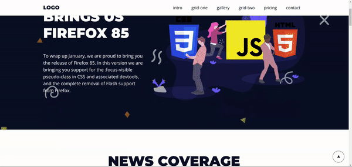

<h2><b>✏️ Sobre</b></h2> 

## Landing Page [Curso Prof - Luiz Miranda ](https://github.com/luizomf)

<b>Repositório API</b>
https://github.com/jaocordeiro/strapi_backend_landing_pages

---

<h2><b>  👨🏼‍💻 Bibliotecas utilizadas no projeto</b></h2>

- [ReactJs](https://reactjs.org/)
  - O framework **ReactJs** é utilizado para o desenvolvimento de
    aplicações/sites web com JavaScript.
- [Styled Components](https://styled-components.com/)
  - O **Styled-Components** é uma biblioteca para a criação de componentes e
    estilização dos mesmos sendo muito utilizada hoje em dia para aplicações
    ReactJS e React Native, a mesma usa o CSS-in-JS.
  - No projeto a mesma foi utilizada para auxiliar na criação dos componentes
    das páginas e estilização das mesmas. **Version 5.3.6**
- [Strapi](https://strapi.io/)
  - O **Strapi** é um serviço de gerenciamento de conteúdo (Content Management
    Service, ou CMS, em inglês) open-source e headless. Ele permite ao usuário
    criar APIs de alta qualidade em Javascript, tudo através de uma interface
    gráfica do usuário, simples e direta.

---

<h2><b> 📱Resultado final da aplicação</b></h2> 

---

<h2><b> 💻 Requisitos para rodar o projeto</b></h2>

- **Node.js** - version >= `18.9.0`
- **NPM** - version >= `8.19.1`
- **Strapi** - version >= `4.6.0`

---

<h2><b> 📲 Como iniciar o Projeto:</b></h2> 

Efetuar o clone deste repositório, e da API, colando em seu terminal o seguinte
comando:

API: `git clone https://github.com/jaocordeiro/strapi_backend_landing_pages.git`

Após clonar a api rodar **npm i** para instalar as dependências e **npm start**
para subir a api.

Front-end: `git clone https://github.com/jaocordeiro/landing_page_frontend.git`

Após clonar o front basta rodar **npm start** e o site estará rodando em seu
local.

---

 <h2><b>
Obrigado 😃
</b><h2>
